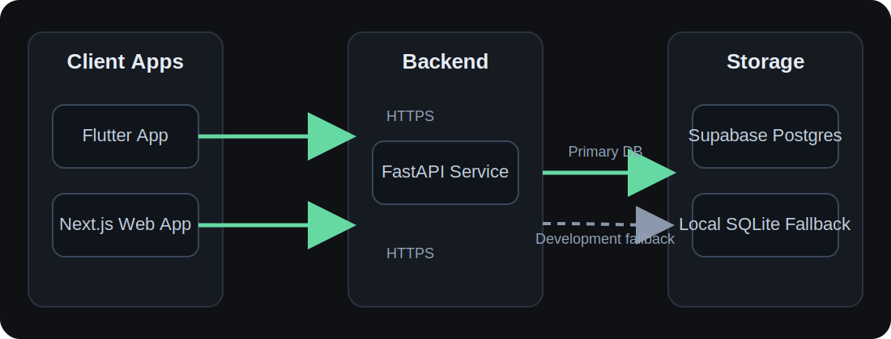
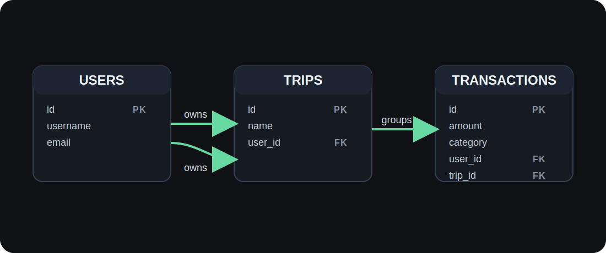

# Personal Ultimate Finance Tracker

Personal Ultimate Finance Tracker, or PUFT, is a multi-client finance tracking workspace built around a shared backend and Supabase-backed data model. The repository contains the Flutter app, a Next.js web app, and the FastAPI service that powers authentication, transactions, and trip management.

## What is in this repo

- `lib/` - Flutter app entrypoint and UI
- `apps/web/` - Next.js web client
- `apps/api/` - FastAPI backend service
- `supabase/` - PostgreSQL migrations and database schema
- `docs/` - design notes and planning docs
- `test/` - Flutter tests

## Tech stack

- Flutter for the cross-platform app
- Next.js and React for the web dashboard
- FastAPI and SQLAlchemy for the backend API
- Supabase PostgreSQL for persistent storage

## Product areas

- Authentication and user profile handling
- Transaction capture, editing, and filtering
- Trip-based expense grouping
- Shared data access through the API and database migrations

## High-Level Architecture

## Core Data Model

## Local development

Each app has its own setup and run instructions:

- [Flutter app](lib/main.dart)
- [Web app](apps/web/README.md)
- [API service](apps/api/README.md)

For the database schema and backend design, see:

- [Architecture and design notes](docs/design.md)
- [Getting started plan](docs/getting-started-plan.md)

## Database

Database changes live in `supabase/migrations/`. The backend can use a local SQLite fallback for development, but the intended shared database is Supabase PostgreSQL.

## Status

This repository is actively under development, so the README stays intentionally high level. The app-specific readmes contain the day-to-day setup details.
