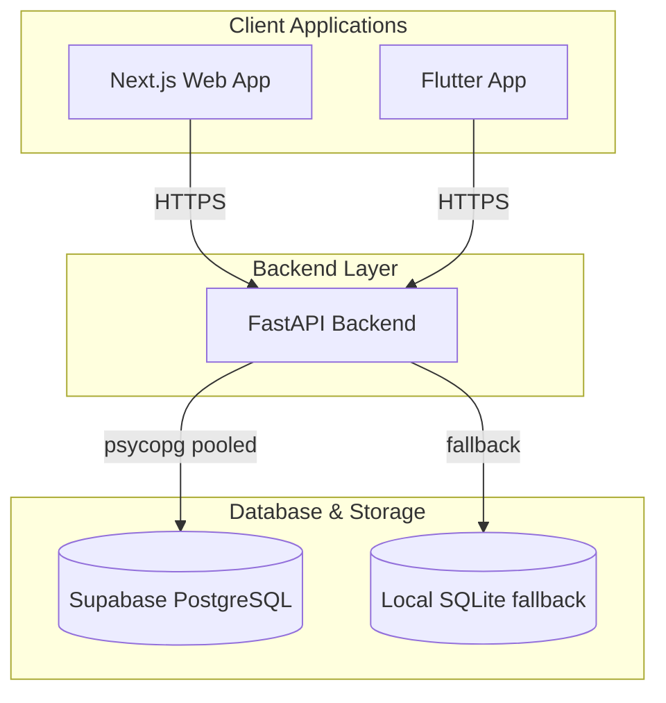
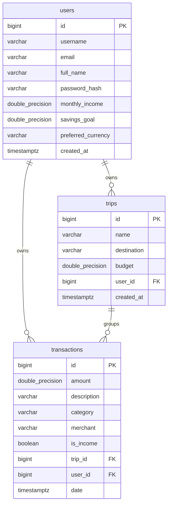

# Personal Ultimate Finance Tracker (PUFT) - Architecture & Design Document

This document outlines the system architecture, database schema, API design, and component layout for the Personal Ultimate Finance Tracker (PUFT).

---

## 1. System Architecture

PUFT uses a client-server architecture with multi-platform client options, a stateless FastAPI service, and a Supabase-managed PostgreSQL database.

---

## 2. Technology Stack

| Layer | Technology | Details |
|---|---|---|
| **Web Frontend** | **Next.js 16.2.6** / **React 19.2.4** | App Router, SSR, TypeScript, Vanilla CSS + CSS Modules |
| **Mobile Frontend** | **Flutter** | Dart-based cross-platform client (Android, iOS, Web) |
| **Backend API** | **FastAPI** / **Uvicorn** | Python 3, Pydantic v2 schemas, SQLAlchemy (repository pattern) |
| **Database** | **PostgreSQL (Supabase)** | Managed DB with Row Level Security (RLS) enabled. SQLite is utilized as a local fallback for offline/development environments |

---

## 3. Database Schema

All database migrations are stored in [supabase/migrations/](file:///d:/Dev/Personal/personal%20ultimate%20%20finance%20tracker/supabase/migrations/). The schema models core entities: Users, Transactions, and Trips.

### Entity Relationship Model

### Table Definitions

#### `public.users`
* Contains individual credentials, income source defaults, savings targets, and preferences.
* Row Level Security (RLS) is enabled. Explicitly revokes all direct Access API access from `anon` and `authenticated`. Access is brokered via backend API server-side logic.

#### `public.trips`
* Represents grouped expense containers (trips, events, or categories of split payments).
* Foreign Key `user_id` links to `users(id)` with `on delete cascade`.

#### `public.transactions`
* Stores both Income and Expense transactions.
* Foreign Keys:
  * `trip_id` links to `trips(id)` with `on delete set null`.
  * `user_id` links to `users(id)` with `on delete cascade`.
* Indexes placed on (`date desc`), `category`, `merchant`, `trip_id`, and `user_id` for optimal query speed.

---

## 4. API Endpoints Design

The FastAPI backend defines routing modules for standard CRUD and database operations:

| Method | Endpoint | Description |
|---|---|---|
| `GET` | `/health` | API service status check |
| `GET` | `/health/db` | Database connection status |
| `GET` | `/transactions` | Retrieve user transactions (supports filters) |
| `POST` | `/transactions` | Create a new transaction |
| `GET` | `/trips` | Retrieve user-owned trips |
| `POST` | `/trips` | Create a new trip (group) |

---

## 5. Web Frontend Design & Structure

The Next.js app layout relies on a clean, modern grid-based interface using CSS Variables for theme management.

* **Core Styling**: Managed in [workspace.css](file:///d:/Dev/Personal/personal%20ultimate%20%20finance%20tracker/apps/web/src/app/workspace.css) and [globals.css](file:///d:/Dev/Personal/personal%20ultimate%20%20finance%20tracker/apps/web/src/app/globals.css) with CSS-variable based themes supporting Dark Mode by default.
* **Authentication**: Managed through [auth-client.tsx](file:///d:/Dev/Personal/personal%20ultimate%20%20finance%20tracker/apps/web/src/app/auth-client.tsx) handling signups, logins, and session storage.
* **Client Pages**:
  * [page.tsx](file:///d:/Dev/Personal/personal%20ultimate%20%20finance%20tracker/apps/web/src/app/page.tsx) — Main dashboard including quick entry box, transaction stream list, and cashflow charts.
  * `/daily` — Detailed day-to-day budget tracker.
  * `/trips` — Trip split details and overview.
